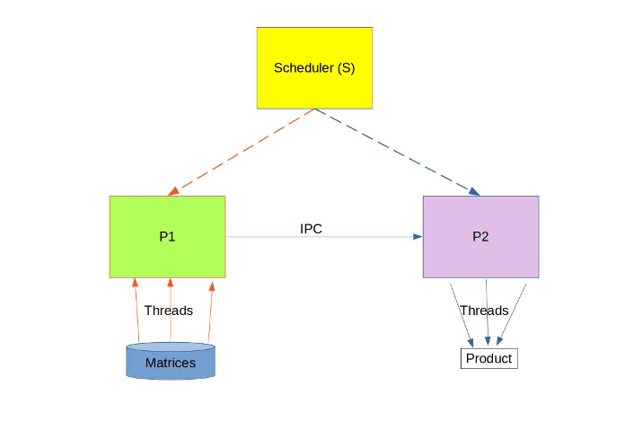

## Multithreaded Matrix Multiplication using Round Robin Scheduler

We implemented matrix multiplication using multithreading and scheduled those processes using Round Robin Scheduler with multiple time quanta's. We analyzed how the program's completion time varies with the number of threads for a specific time quanta.

### Brief Description

P1.c - program reads both matrices's from the txt files using multiple threads and stores the data in shared memory.
P2.c - program which accesses the matrix elements in shared memory and computes the resultant matrix using multiple threads, and stores the matrix in out.txt
Scheduler.c - a program that implements round-robin scheduling for P1.c and P2.c.



### How to run the program
- Compile script.cpp as ```g++ wrapper.cpp -o wrapper.out```
- Run the program as ```./wrapper.out i j k in1.txt in2.txt out.txt```

where the sizes of matrices of input matrices are ixj and jxk. in1.txt and in2.txt contain the input matrix 1 and the transpose of input matrix 2 respectively. out.txt will contain the product matrix.

wrapper.cpp generates two random matrices of size ixj and jxk and stores them in in1.txt and OF_in2.txt. Then it transposes the second matrix and stores in in2.txt. It also generates the product matrix and stores in matrixResult.txt. Then it compiles Scheduler.c, P1.c, and P2.c and runs the scheduler as S.out .
